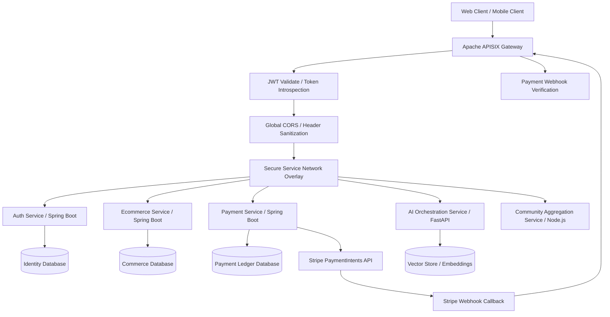
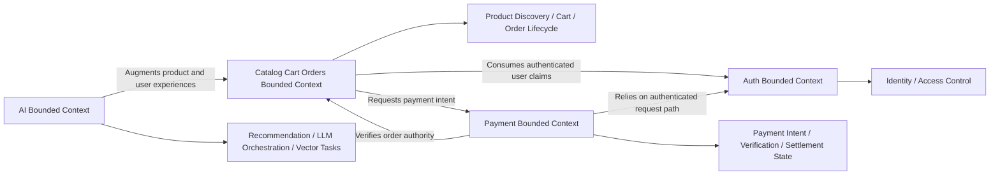
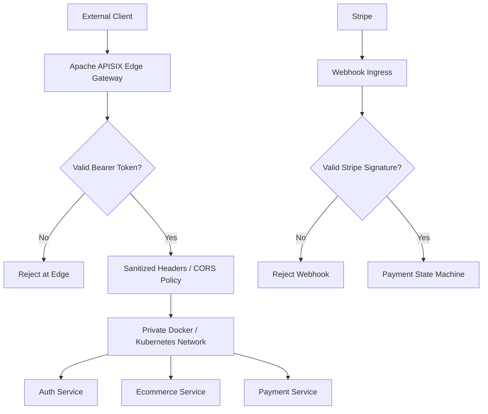
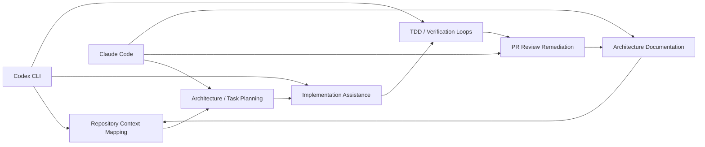

# EatToday — Distributed Microservices Architecture & Design Specs

EatToday is an AI-first, multi-language microservices platform designed around high availability, strict domain isolation, and secure API mediation. This public repository is an architecture showroom for the private EatToday implementation. It intentionally contains no backend source code, frontend source code, secrets, keys, environment files, Stripe credentials, or deployable application artifacts.

The goal of this specification is to present the system design, security model, bounded contexts, and development operating model in a form suitable for technical review by CTO-level evaluators, engineering leadership, academic placement reviewers, and architecture interview panels.

## 🏗️ System Topology & Distributed Infrastructure

EatToday is organized as a distributed platform where all public traffic enters through a centralized API gateway. Internal services are isolated behind container and orchestration networking, and direct host access to service ports is intentionally sealed. This design reduces accidental exposure, creates a deterministic ingress path, and makes edge policy enforcement consistent across the platform.

### Infrastructure Principles

- **Single ingress path:** public API access is mediated by Apache APISIX rather than exposed directly by backend services.
- **Container-first local topology:** services run in isolated Docker networks during development and are designed for Kubernetes orchestration in production.
- **Zero direct backend port exposure:** internal microservices do not rely on public host port bindings for normal operation.
- **Gateway-owned edge policy:** authentication, CORS, header hygiene, and routing are enforced before requests reach domain services.
- **Polyglot service strategy:** Java, Python, and Node.js are used where each runtime provides clear operational or domain advantages.

### Technology Stack

| Layer | Technology | Architectural Role |
| --- | --- | --- |
| API Gateway | Apache APISIX | Global ingress, JWT validation, CORS, routing, edge policy enforcement |
| Core Backend | Java, Spring Boot | Transactional domains requiring strong consistency and mature enterprise patterns |
| AI Service | Python, FastAPI | LLM orchestration, vector retrieval, embeddings, AI task coordination |
| Async Aggregation | Node.js | Lightweight asynchronous state aggregation and community-oriented workloads |
| Payments | Stripe PaymentIntents | Secure fintech-grade payment authorization and confirmation workflows |
| Runtime | Docker | Reproducible service packaging and isolated local networks |
| Orchestration | Kubernetes | Production-grade scaling, rollout, health, and service networking model |
| Frontend/BFF | TypeScript, Next.js | Client experience and frontend-specific API orchestration |

## 🧠 Domain-Driven Design (DDD) & Service Boundaries

EatToday follows Domain-Driven Design by separating business capabilities into bounded contexts. Each service owns its domain model, persistence boundary, and invariants. Cross-service communication is treated as integration between bounded contexts rather than shared database access.

### Auth Bounded Context

The Auth context owns identity, credential verification, JWT issuance, token validation, and lightweight user profile data. Other services consume identity claims and bearer-token validity but do not reimplement authentication logic.

**Aggregates**

- **User Account Aggregate:** root aggregate for credentials, profile metadata, and role assignments.
- **Role Assignment Aggregate:** controls supported authority vocabulary and user-role association rules.

**Entities**

- **User:** account identity, username, email, password hash, profile metadata, and assigned roles.
- **Role:** persisted authority such as user, moderator, or administrator.

**Value Objects**

- **JWT Claims:** subject, user identifier, roles, and expiry used across downstream services.
- **Profile Update Request:** bounded profile mutation shape for bio and avatar metadata.
- **Login Credentials:** username/password input handled only by the identity boundary.

**Primary Responsibilities**

- Authenticate users with secure password verification.
- Issue signed JWT bearer tokens.
- Validate tokens for gateway and downstream service consumption.
- Maintain role vocabulary and profile metadata.

### Catalog, Cart, and Orders Bounded Context

The Ecommerce context owns the core commerce lifecycle: product discovery, cart operations, address selection, inventory reservation, loyalty-point application, order creation, and order payment state transitions.

**Aggregates**

- **Product Catalog Aggregate:** root for sellable items, categories, search visibility, and catalog metadata.
- **Cart Aggregate:** root for user shopping intent before order creation.
- **Order Aggregate:** root for checkout, inventory reservation, loyalty deduction, payment amount calculation, and order status.
- **Address Aggregate:** root for customer delivery destinations and default address behavior.

**Entities**

- **Product:** sellable item with category, pricing, availability, and catalog metadata.
- **Cart Item:** product reference and quantity selected by a user.
- **Order:** customer order with status, totals, payment amount, address, and item lines.
- **Order Item:** immutable order-line snapshot derived from cart state.
- **Address:** user-owned delivery location.

**Value Objects**

- **Money / Payment Amount:** calculated amount after discounts and loyalty application.
- **Order Status:** lifecycle state such as pending, paid, cancelled, or fulfilled.
- **Inventory Reservation:** temporary allocation used to protect stock during checkout.
- **Loyalty Point Deduction:** discount intent applied at order creation.

**Primary Responsibilities**

- Preserve commerce invariants around price, stock, and order ownership.
- Create authoritative order totals rather than trusting browser-submitted amounts.
- Coordinate with the Payment context for payment verification.
- Expose catalog and order APIs through the gateway-mediated request path.

### Payment Bounded Context

The Payment context owns Stripe orchestration, local payment records, PaymentIntent creation, webhook verification, and payment state reconciliation. It does not own cart, pricing, or final order-state authority.

**Aggregates**

- **Payment Aggregate:** root for local payment record, Stripe PaymentIntent correlation, amount, currency, and status.
- **Webhook Event Handling Aggregate:** governs verified Stripe callback processing and asynchronous state transitions.

**Entities**

- **Payment:** local payment ledger record with order correlation, amount, currency, Stripe intent id, status, and creation timestamp.
- **Webhook Event:** verified Stripe event used to update asynchronous payment state.

**Value Objects**

- **PaymentIntent Reference:** Stripe PaymentIntent id and client secret correlation.
- **Payment Status:** pending, succeeded, or cancelled state machine value.
- **Webhook Signature:** cryptographic proof that the callback originated from Stripe.
- **Internal Service Secret:** server-to-server protection for privileged internal callbacks.

**Primary Responsibilities**

- Create Stripe PaymentIntents only after validating authoritative order data.
- Persist local payment state for reconciliation and verification.
- Verify Stripe webhook signatures before processing asynchronous events.
- Expose verification results back to the Ecommerce context.
- Cancel or reconcile stale payment attempts through scheduled cleanup.

## 🛡️ Edge Security & Threat Mitigation

Security is intentionally enforced at multiple layers, with the gateway acting as the first and most important policy boundary. The architecture avoids relying on developer discipline or accidental port availability as a security mechanism.

### Centralized Edge Authentication

EatToday uses Apache APISIX as the global edge-authentication tier. JWT validation and token introspection occur before protected requests are routed to backend services. This creates a consistent security posture across all domains and reduces duplicated authentication code inside individual services.

Key properties:

- Bearer-token validation is centralized at ingress.
- Token introspection is handled through a deterministic authentication boundary.
- Downstream services receive requests only after gateway policy evaluation.
- Invalid or malformed tokens are rejected before reaching domain logic.

### Network Port Sealing

Internal services are not exposed through public host port bindings during normal operation. Instead, service-to-service communication occurs over controlled Docker or Kubernetes network overlays.

Threats mitigated:

- Accidental direct access to backend service ports.
- Bypassing APISIX authentication and CORS policy.
- Environment drift where local developer ports become assumed production ingress.
- Uncontrolled service discovery from outside the trusted network.

### CORS and Header Hygiene

Global CORS preflight enforcement and strict header handling are performed at the edge. This keeps browser access rules consistent and prevents individual services from drifting into conflicting CORS implementations.

Security benefits:

- One policy location for allowed origins, methods, and headers.
- Reduced risk of permissive service-local CORS configuration.
- Consistent handling of preflight requests.
- Cleaner separation between transport policy and domain behavior.

### Stripe Webhook Cryptography

The payment tier treats Stripe webhooks as untrusted until cryptographically verified. Webhook signature validation is required before state transitions are applied.

Fintech-grade controls:

- Webhook signature verification using Stripe-provided signing material.
- Asynchronous payment state machine for pending, succeeded, and cancelled payments.
- Local payment ledger correlation by order id and Stripe PaymentIntent id.
- Reconciliation path for stale or abandoned payment attempts.
- Server-to-server internal callbacks protected by explicit internal secrets.

## 🚀 AI-First Development Lifecycle

EatToday was engineered with an AI-first development workflow, using CLI-native tools such as Claude Code and Codex as daily development accelerators. These tools are not treated as generic chat assistants; they are embedded into the engineering lifecycle for codebase navigation, architecture mapping, test planning, static analysis, and documentation generation.

### Applied AI Engineering Practices

- **Full-lifecycle context mapping:** AI tooling is used to traverse service boundaries, identify integration points, and maintain architectural understanding across a multi-language codebase.
- **TDD validation support:** test intent, command execution, and failure analysis are integrated into the implementation loop.
- **Automated AST and dependency analysis:** CLI-native analysis helps identify coupling, module boundaries, generated artifacts, and impacted files.
- **PR feedback acceleration:** review comments are converted into targeted refactors, verification commands, and documentation updates.
- **Architecture documentation generation:** documentation is generated and curated from real repository structure while excluding private source code from this public showroom.

### Velocity Outcomes

This AI-first workflow improves engineering throughput without removing architectural accountability. The principal gains are:

- Faster onboarding into complex service boundaries.
- Shorter review-to-fix cycles for security, generation, and infrastructure feedback.
- More consistent documentation of domain boundaries and operational assumptions.
- Reduced cognitive load when validating cross-service behavior.
- Higher confidence that generated contracts, gateway behavior, and Docker workflows remain aligned.

## Public Repository Safety Statement

This repository is intentionally documentation-only. It is designed to communicate engineering depth without exposing proprietary implementation details.

It does not contain:

- backend service source code
- frontend application source code
- Stripe API keys or webhook secrets
- JWT signing secrets
- environment files
- deployment credentials
- private business logic implementations
- customer or production data

The public artifact focuses on architecture, security design, domain boundaries, and engineering process. It is suitable for portfolio review, technical interviews, academic placement evaluation, and architecture discussion without compromising private intellectual property.
