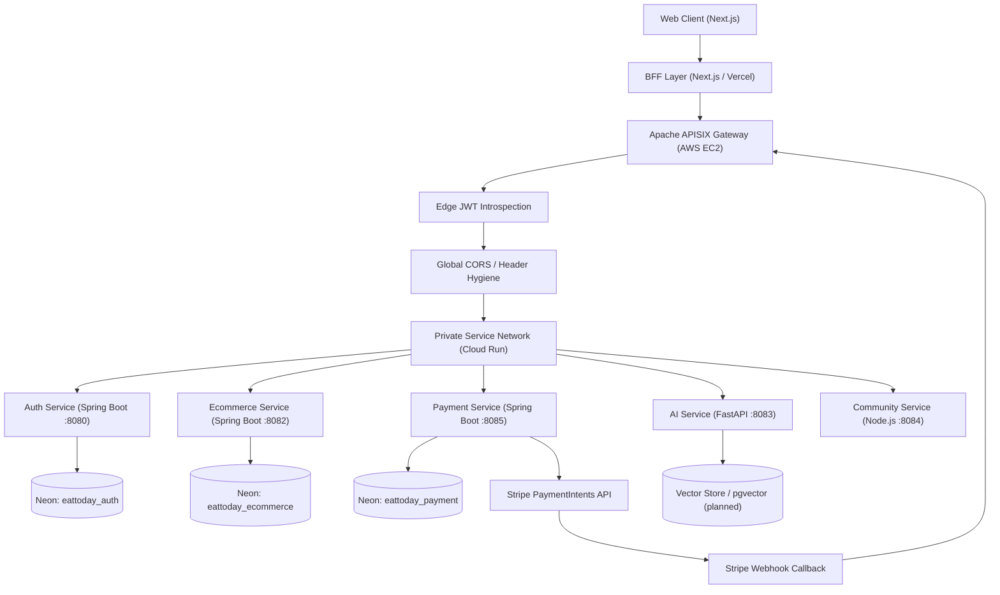
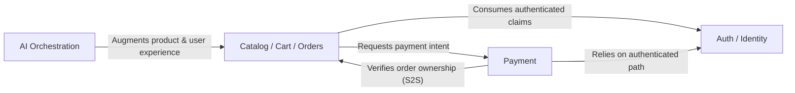
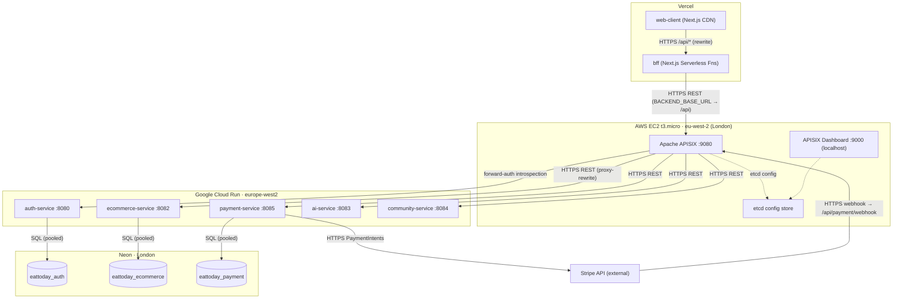
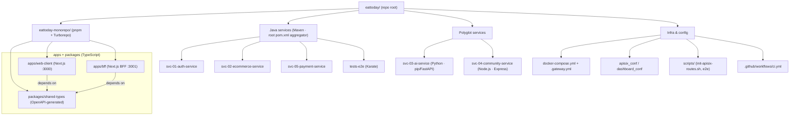

# EatToday — AI-First Culinary Microservices Platform

> **An AI-first, multi-language microservices digital culinary platform** — bridging culinary creativity, food sustainability, and local e-commerce.

[](https://eattoday-web.vercel.app/)
[-blue?style=for-the-badge)](#current-focus-v011)
[](#system-architecture-overview)

> **Disclaimer:** This is a **public architecture showroom**. The original implementation repository is private because it contains sensitive development information — secrets, credentials, payment integration code, and proprietary business logic. This repository contains **no backend source, frontend source, secrets, or deployable artifacts** — only architecture, design rationale, and engineering process derived from the real codebase.

---

## Project Overview

**EatToday** is an AI-first, multi-language microservices platform that bridges culinary
creativity, food sustainability, and local e-commerce. It provides AI-personalized recipe
solutions based on the ingredients a user already has, helping reduce household food waste,
empowering everyday users to become content creators, and serving as a high-conversion sales
channel for local food suppliers.

The platform is engineered around three architectural commitments: **high availability**
(serverless containers with warm-instance pinning and connection pooling), **strict domain
isolation** (each service owns its data and invariants as a Domain-Driven Design bounded
context), and **secure API mediation** (all public traffic enters through a single hardened
API gateway that enforces authentication, CORS, and routing at the edge).

It is built as five backend microservices (Java/Spring Boot, Python/FastAPI, Node.js/Express),
a Next.js storefront with a dedicated Backend-for-Frontend layer, an Apache APISIX gateway, and
Stripe-backed payments — deployed across Vercel, AWS, Google Cloud Run, and Neon.

---

## Live Deployment

| Layer | URL | Hosting |
| --- | --- | --- |
| **Web Client** | **[eattoday-web.vercel.app](https://eattoday-web.vercel.app/)** | Vercel CDN Edge / Static Assets (`apps/web-client`) |
| **BFF API Layer** | [eattoday-bff.vercel.app](https://eattoday-bff.vercel.app) | Vercel Serverless Functions (`apps/bff`) |
| **API Gateway** | AWS EC2 `t3.micro`, `eu-west-2` (London) | Apache APISIX data plane (port `9080`) |
| **Backend Services** | Google Cloud Run, `europe-west2` | 5 serverless containers via Artifact Registry |
| **Database** | Neon, London region | Serverless PostgreSQL 15 (pooled connections) |

**End-to-end production path:**
`Vercel UI → Vercel BFF → AWS EC2 (APISIX gateway) → Google Cloud Run services → Neon Postgres`

**Current release status:** **v0.1.1 in preparation.** v0.1.0 reached a fully deployed
multi-cloud MVP; v0.1.1 focuses on **deployment stabilization and cross-cloud troubleshooting**
(see [Current Focus](#current-focus-v011)).

---

## System Architecture Overview

All public traffic enters through a single centralized API gateway. Internal services are
isolated behind container/orchestration networking, and direct host access to service ports is
intentionally sealed. This produces a deterministic ingress path and makes edge-policy
enforcement consistent across every domain.



### Domain isolation & service boundaries

EatToday follows **Domain-Driven Design**: each service owns its domain model, persistence
boundary, and invariants. Cross-service communication is treated as integration between bounded
contexts — **never shared database access**. Logical database isolation is enforced at the data
tier with three separate Neon databases (`eattoday_auth`, `eattoday_ecommerce`,
`eattoday_payment`).



### Multi-cloud deployment topology

The MVP is deliberately spread across four providers, each chosen for a specific tier. The
diagram below maps which components live in which cloud boundary and how traffic crosses them —
following the BFF's `BACKEND_BASE_URL` → APISIX → Cloud Run → Neon chain confirmed in the configs.



---

## Microservices Breakdown

The repository is a polyglot mono-repo: a pnpm/Turborepo workspace for the TypeScript front
end, Maven-built Java services (aggregated by a root `pom.xml`), and standalone Python/Node
services — all wired together by shared infra configs. The tree below shows the grouping, the
build tool per group, and the `shared-types` dependency edges.



Derived directly from the source repository structure (`svc-01` … `svc-05` + monorepo apps).

| Service | Responsibility | Tech Stack | Port | Gateway Routes |
| --- | --- | --- | --- | --- |
| **svc-01-auth-service** | Authentication, JWT issuance & introspection, roles, user profiles | Java 17, Spring Boot 3.2, Spring Security, Spring Data JPA, JJWT 0.12.5, springdoc-openapi | `8080` | `/api/auth/*`, `/api/profile/*` |
| **svc-02-ecommerce-service** | Product catalog, cart, orders, transactional inventory, loyalty points, addresses | Java 17, Spring Boot 3.2, Spring Security, Spring Data JPA, springdoc, Testcontainers | `8082` | `/api/products`, `/api/orders`, `/api/cart`, `/api/loyalty`, `/api/inventory`, `/api/addresses` |
| **svc-03-ai-service** | AI recipe engine (recommendations, LLM orchestration, embeddings) — skeleton stage | Python 3.12, FastAPI 0.115, Uvicorn; planned Supabase + PostgreSQL `pgvector` | `8083` | `/api/ai/*` |
| **svc-04-community-service** | Community/content aggregation & async workloads — skeleton stage | Node.js 20, Express 4.22, Jest | `8084` | `/api/community/*` |
| **svc-05-payment-service** | Stripe PaymentIntent orchestration, webhook verification, payment ledger & idempotency | Java 17, Spring Boot 3.2, Spring Data JPA, `stripe-java` | `8085` | `/api/payment/*` |
| **apps/web-client** | E-commerce storefront UI | Next.js 14, React 18, TypeScript, Tailwind CSS, Zustand, Axios, Stripe.js | `3000` | — (served via Vercel CDN) |
| **apps/bff** | Backend-for-Frontend: API aggregation & auth-header/cookie mediation for browser traffic | Next.js 14 (Serverless), TypeScript | `3001` | — (Vercel Functions) |
| **packages/shared-types** | OpenAPI-generated TypeScript contracts shared by web-client & BFF (type-drift CI guard) | TypeScript, OpenAPI codegen | — | — |

**Edge & data tier (infrastructure):** Apache APISIX 3.9 data plane (`9080`), APISIX Dashboard
3.0.1 (`9000`, localhost-only), etcd 3.5 config store, PostgreSQL 15 (`5432` local / Neon in cloud).

---

## Tech Stack

**Frontend**
`Next.js 14` · `React 18` · `TypeScript` · `Tailwind CSS` · `Zustand` (state) · `Axios` · `@stripe/react-stripe-js` · `lucide-react`

**Backend Services**
`Java 17` · `Spring Boot 3.2` · `Spring Security` · `Spring Data JPA` · `JJWT` · `springdoc-openapi` · `Python 3.12` · `FastAPI` · `Uvicorn` · `Node.js 20` · `Express`

**AI Layer**
`FastAPI` orchestration service (skeleton) · planned `Supabase` + `PostgreSQL pgvector` for LLM embeddings & RAG retrieval

**Infra & DevOps**
`Apache APISIX 3.9` (gateway) · `etcd 3.5` · `Docker` / `Docker Compose` · `AWS EC2` · `Google Cloud Run` · `Google Artifact Registry` · `Vercel` · `GitHub Actions` (CI build matrix) · `Turborepo` · `pnpm` · `Maven`

**Data**
`PostgreSQL 15` · `Neon` (serverless, pooled, logically isolated DBs) · `Stripe` (payments)

**Quality**
`Karate DSL 1.4` + `JUnit 5` (gateway-routed E2E) · `Playwright` (UI E2E) · `Testcontainers` · `Pytest` · `Jest`

---

## Deployment Strategy

**Containerization & orchestration.** Every service ships as a multi-stage Docker image (Java,
Python, and Node variants), runs locally via Docker Compose on an isolated bridge network, and
deploys to **Google Cloud Run** as serverless containers pushed through **Google Artifact
Registry** (`europe-west2`). A separate Compose override layers the APISIX gateway stack (etcd +
data plane + dashboard) on top of the backend stack without modifying the base file.

**Multi-cloud topology.** The MVP deliberately spreads across providers to match each tier's
strengths: Vercel for edge-cached UI and serverless BFF, an inexpensive AWS EC2 `t3.micro`
co-located near the GCP region to host APISIX, Cloud Run for autoscaling stateless services, and
Neon for serverless Postgres with connection pooling.

**Gateway as single ingress.** APISIX is the only public entry point (port `9080`). Backend
service host ports are sealed — they are reachable only over the private service network. The
gateway is configured by an **idempotent Infrastructure-as-Code script** (`init-apisix-routes.sh`)
that registers upstreams, routes, CORS, the static health endpoint, and the edge JWT plugin via
the Admin API. Upstream targets, scheme, and host-passing mode are **12-factor / environment-driven**,
so the same script configures local Docker DNS or production Cloud Run `*.run.app:443` (with
`UPSTREAM_SCHEME=https` and `pass_host=node` for SNI/TLS host routing).

**Environment strategy.** Branch-based: `main`/`develop` run the GitHub Actions CI matrix
(parallel Java/Python/Node builds + tests); the production Vercel domain is bound to the
`release/v0.1.x` line. Required secrets are enforced with fail-fast startup — services refuse to
boot if a secret is missing, with **no hardcoded fallbacks**.

**Resilience tuning.** Spring Boot cold starts on Cloud Run could exceed the gateway upstream
timeout (surfacing as `504`s), mitigated by pinning warm instances (`--min-instances 1`) on
latency-sensitive services; Neon's pooled endpoint prevents connection exhaustion under
concurrent serverless load.

---

## Key Engineering Decisions

1. **Polyglot microservices over a monolith.** Java/Spring Boot handles transactional commerce
   and payment domains that demand strong consistency and mature enterprise patterns; Python/FastAPI
   is reserved for the AI engine (natural fit for the LLM/vector ecosystem); Node.js/Express covers
   lightweight async community aggregation. Each runtime is used where it provides a clear
   operational or domain advantage — not for novelty.

2. **Gateway-mediated edge security instead of native JWT plugins.** Rather than APISIX's native
   `jwt-auth` (which tightly couples consumer secrets to the gateway), the edge policy calls the
   auth-service's `/api/auth/validate` introspection endpoint. This keeps the auth-service the
   **single authority on token validity** and avoids duplicating auth logic across services.

   The sequence below traces the real flow: the web client persists the JWT in **LocalStorage**
   and replays it as `Authorization: Bearer`; the BFF faithfully proxies that header (falling back
   to its `bff_token` httpOnly cookie); and APISIX runs a `serverless-pre-function` that introspects
   the token against the auth-service's `/api/auth/validate` before any protected service is reached.

   ```mermaid
   sequenceDiagram
       participant B as Browser (LocalStorage)
       participant F as BFF (Next.js)
       participant G as APISIX Gateway
       participant A as Auth Service
       participant T as Target Service

       Note over B,A: Login
       B->>F: POST /api/auth/signin
       F->>G: POST /api/auth/signin (public route)
       G->>A: POST /api/auth/signin
       A-->>G: 200 { token, user }
       G-->>F: 200 { token, user }
       F-->>B: 200 { accessToken, ...user } + Set-Cookie bff_token
       Note over B: store accessToken in LocalStorage

       Note over B,T: Authenticated request
       B->>F: GET /api/orders/me (Authorization: Bearer <jwt>)
       F->>G: GET /api/orders/me (Authorization relayed)
       G->>A: GET /api/auth/validate (Authorization header)
       alt token valid (200)
           A-->>G: 200 { status: valid }
           G->>T: forward request
           T-->>G: 200 data
           G-->>F: 200 data
           F-->>B: 200 data
       else token invalid / missing
           A-->>G: 401
           G-->>F: 401 (rejected at edge)
           F-->>B: 401
       end
   ```

3. **Server-authoritative commerce, never client-trusted.** Order totals, inventory reservation,
   and loyalty deductions are computed server-side. Inventory mutations require the `ADMIN` role
   (Spring Security method-level `@PreAuthorize`). Order timestamps are serialized as UTC ISO-8601
   and rendered in each user's browser-local timezone.

4. **Fintech-grade payment integrity.** Stripe webhooks are treated as untrusted until the
   signature is cryptographically verified; PaymentIntent creation is **idempotent** (a unique
   `order_id` constraint + pending-intent reuse) to prevent duplicate charges; internal S2S
   verification calls are protected by an explicit internal secret.

   This sequence maps the confirmed payment path. On `POST /api/payment/create-intent` the payment
   service first relays the caller's token to `ecommerce` to confirm order ownership, then checks
   `paymentRepository.findByOrderId(...)` — **the idempotency guard**: an existing record reuses its
   Stripe PaymentIntent instead of creating a duplicate. Stripe later calls the public
   `/api/payment/webhook` route, whose handler verifies the `Stripe-Signature` via
   `Webhook.constructEvent(...)` before updating the ledger; a `payment_intent.payment_failed` event
   triggers an S2S `X-Internal-Secret`-protected cancel call back to `ecommerce`.

   ```mermaid
   sequenceDiagram
       participant B as Browser
       participant F as BFF
       participant G as APISIX
       participant P as Payment Service
       participant C as Commerce Service
       participant S as Stripe API
       participant W as Stripe Webhook

       B->>F: POST /api/payment/create-intent
       F->>G: POST /api/payment/create-intent (JWT)
       G->>P: POST /api/payment/create-intent
       P->>C: GET /api/orders/{orderId} (S2S ownership check)
       C-->>P: 200 order
       alt existing payment (findByOrderId present)
           Note over P: idempotency — reuse PaymentIntent
           P->>S: PaymentIntent.retrieve(existingId)
       else new order
           P->>S: PaymentIntent.create (metadata orderId)
       end
       S-->>P: { id, clientSecret }
       P-->>B: { clientSecret } (via G/F)

       B->>S: confirmPayment(clientSecret)
       S->>G: POST /api/payment/webhook (Stripe-Signature)
       G->>W: POST /api/payment/webhook (public route)
       Note over W: Webhook.constructEvent() — verify signature
       alt payment_intent.succeeded
           W->>W: ledger → SUCCEEDED
       else payment_intent.payment_failed
           W->>W: ledger → CANCELLED
           W->>C: POST /api/orders/internal/{orderId}/cancel (X-Internal-Secret)
       end
       W-->>S: 200 OK
   ```

5. **Type-safe frontend/backend contract.** A Turborepo + pnpm monorepo shares an OpenAPI-generated
   TypeScript package between the web client and BFF, with a CI **type-drift check** that fails the
   build if frontend types diverge from the backend API spec.

---

## Current Focus: v0.1.1

After v0.1.0 reached a fully deployed multi-cloud MVP, v0.1.1 concentrates on **deployment
stabilization and cross-cloud troubleshooting** — the hard part of making a distributed system
actually work end-to-end across four providers.

**In scope:**

- **Auth propagation fixes (BFF → gateway).** Resolving `401` errors caused by token handling
  across cloud boundaries — faithfully proxying the `Authorization` header / LocalStorage token
  through the BFF to APISIX, and returning the access token in sign-in/sign-up responses for
  reliable client-side persistence.
- **Dynamic, environment-driven gateway config.** Making APISIX upstreams and the CORS allowlist
  fully dynamic (`UPSTREAM_*`, `ALLOWED_ORIGINS`) so the same IaC script works locally and against
  live Cloud Run hosts.
- **Context-aware routing refactor** and API prefix rewriting at the edge.
- **Cloud Run cold-start mitigation** and Neon production seed/connection hardening.

**Out of scope (deferred):** the automated GitHub Actions CD pipeline for Cloud Run, and bringing
the AI and community services from skeleton stage to full implementation.

---

## Disclaimer

This repository is intentionally **documentation-only** and is maintained separately from the
production codebase. It communicates engineering depth without exposing proprietary
implementation details.

It does **not** contain:

- backend or frontend application source code
- Stripe API keys, webhook secrets, or JWT signing secrets
- environment files or deployment credentials
- private business logic implementations
- customer or production data

Sensitive business logic and credentials are excluded by design. The public artifact focuses on
architecture, security design, domain boundaries, and engineering process — suitable for portfolio
review, technical interviews, and architecture discussion without compromising private intellectual
property.
